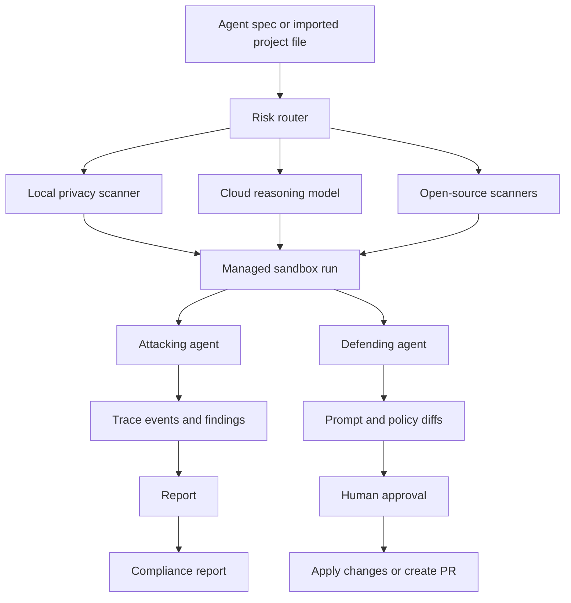

# Fresh Agent Feature Handoff

Last updated: 2026-05-23

Use this document as the reusable context packet for each fresh agent that works on a new DevBox feature. Paste the relevant feature request above or below this file and ask the agent to implement one scoped slice.

## Feature Request Template

```markdown
## New Feature

[Describe the exact feature to build.]

## User Workflow

[Describe who uses it, where they start, what they click or submit, and what result they need.]

## Expected Output

[Describe the UI, API response, report, PR diff, config change, or test result that should exist when done.]

## Constraints

- Keep the authorized-testing boundary intact.
- Do not send secrets, honeytokens, or private agent prompts to cloud providers unless the feature explicitly requires opt-in routing.
- Preserve existing API contracts unless the feature explicitly changes them.
- Add or update tests for changed behavior.
```

## Product Context

DevBox is an AI Agent Security Lab for the Google I/O hackathon concept. The product reviews the security posture of AI agents by combining managed sandbox execution, multi-model analysis, open-source scanners, attack simulation, defensive remediation, human approval, and audit reporting.

The target user imports or creates an AI agent configuration, including a system prompt, connected tools, MCPs, dependencies, and sandbox policy. DevBox then runs authorized security scenarios, records attack traces, scores findings, proposes fixes, and lets a human approve changes before anything is applied or turned into a PR.

## Hackathon Positioning

The intended pitch is a dual-engine architecture:

- Managed Agents / Sandbox Core: isolated execution for controlled attack and defense workflows.
- Gemini 3.5 Flash Risk Router: fast model that classifies sensitivity and threat severity, then routes work to the right scanner or model.
- Local Privacy Sandbox: Gemma-class local inference for high-risk text such as credentials, PII, and private prompts.
- Deep Cloud Review: stronger cloud models for complex prompt injection, policy reasoning, and multi-turn adversarial review.
- Open-source scanner lane: tools such as garak, LLM Guard, prompt-injection checks, dependency scanners, and policy linters.
- Human-in-the-loop governance: users approve prompt and policy diffs before mutation or PR creation.

Do not treat model names or Google platform feature names as guaranteed API facts during implementation. Before wiring real provider calls, verify the current official docs and available SDK/API names.

## Current Repo Reality

The current codebase is an MVP with deterministic simulations. It is not yet a live multi-provider scanner.

```text
DevBox/
|-- apps/web/                  # Next.js App Router dashboard
|-- services/api/              # FastAPI orchestration API
|-- packages/shared/           # TypeScript contracts and generated OpenAPI types
|-- infra/                     # Docker Compose and sandbox container scaffold
|   `-- policies/             # Shared scenario metadata (@devbox/policies workspace package)
`-- docs/                      # Security model and project documentation
```

Important files:

- `README.md`: setup, verification, and safety boundary.
- `docs/SECURITY_MODEL.md`: current sandbox, provider, and authorization boundaries.
- `services/api/app/contracts.py`: canonical API models.
- `services/api/app/main.py`: FastAPI routes and WebSocket endpoint.
- `services/api/app/run_manager.py`: in-memory run orchestration, attack events, findings, reports, and fix approval.
- `services/api/app/registries.py`: config-driven model and scenario registries.
- `services/api/app/config/models.json`: provider/model metadata and enablement gates.
- `services/api/app/config/scenarios.json`: security scenarios.
- `apps/web/components/security-dashboard.tsx`: main dashboard experience.
- `apps/web/lib/api.ts`: frontend API client.

## Core Architecture



For the MVP, the router, local scanner, cloud model calls, and open-source scanner execution may be simulated or config-driven. Keep interfaces honest so real integrations can replace simulations later.

## Domain Model

AgentSpec:

- Name, system prompt, tools, sandbox policy, and `managed` flag.
- Managed agents can receive approved fixes.
- Imported or unmanaged agents should require explicit opt-in before mutation.

SandboxPolicy:

- Allowed tools.
- Allowed domains.
- Filesystem scope.
- Network egress policy.
- Honeytokens used to detect exfiltration.

Scenario:

- Security test mapped to a category such as prompt injection, RAG injection, secret exfiltration, tool misuse, unsafe browsing, or policy bypass.
- Each scenario has a setup fixture, attack goal, success criteria, expected defense, and default severity.

Run:

- A requested assessment for one agent, one selected model, and one or more scenarios.
- Emits ordered events over WebSocket and eventually produces a report.

Report:

- Score, findings, trace summary, proposed system prompt diff, proposed tool policy diff, and regression tests.

## Two-Agent Composer

The product concept has two coordinated agents:

1. Attacking Agent

Runs adversarial tests mapped to OWASP Top 10 for LLM applications and common AI agent failure modes. It should produce observable traces, not just final findings. It can test prompt injection, RAG poisoning, secret exfiltration, tool boundary breakout, unsafe browsing, dependency/tool misuse, and policy override attempts.

2. Defending Agent

Reads attack logs and generates targeted remediations. Fixes should be specific and reviewable: system prompt hardening, sandbox policy changes, dependency warnings, MCP/tool allowlist changes, regression tests, and compliance mappings.

The defending agent must not silently mutate the target agent. Changes flow through human approval.

## Security Boundaries

Every feature must preserve these rules:

- Authorized testing only. No stealth interception of third-party agents.
- Only test agents created in the lab or connected through explicit opt-in integrations.
- Treat user prompts, web pages, retrieved documents, and scanner outputs as untrusted data.
- Never expose real credentials, PII, or private prompts in logs, cloud requests, screenshots, reports, or PR descriptions.
- Keep honeytokens fake and scoped to detection tests.
- Keep tool execution allowlisted and logged.
- Keep network egress constrained by policy.
- Require human approval before applying prompt, policy, dependency, or repository changes.

## Feature Slice Guidance

When building a new feature, choose one slice and keep it end to end:

- UI slice: dashboard controls, diff viewer, report screen, run timeline, scenario picker, model picker, import flow.
- API slice: new contract fields, route, registry behavior, run manager behavior, report generation, approval workflow.
- Scanner slice: add one scanner interface, simulated implementation, config entry, result normalization, and tests.
- Routing slice: classify sensitivity/severity, choose local/cloud/static lane, record routing rationale, and expose it in events/report.
- Governance slice: map findings to NIST AI RMF, ISO/IEC 42001, OWASP LLM Top 10, or internal controls.
- Git integration slice: generate patch, show diff, require approval, then create branch/commit/PR.
- Sandbox slice: policy check, filesystem/network/tool constraints, event logging, and regression tests.

Avoid starting with broad provider rewrites. Prefer a narrow interface with one simulated implementation and tests unless the feature explicitly asks for real integration.

## Implementation Workflow For Fresh Agents

1. Read `README.md`, `docs/SECURITY_MODEL.md`, and this file.
2. Inspect the exact files touched by the feature. Do not assume the current architecture beyond the code.
3. Identify whether the change is frontend, API, shared contract, config, sandbox, or docs.
4. If API contracts change, update Python contracts, frontend/shared types, API client usage, and tests together.
5. If scenarios or model metadata change, update config files and any frontend assumptions.
6. If a report changes, update the UI rendering and API tests.
7. Add focused tests for the changed behavior.
8. Run the smallest useful verification commands before handing off.

## Verification Commands

Use the commands that match the touched area:

```powershell
pnpm typecheck
.venv\Scripts\python -m pytest services/api/tests
pnpm build
docker build -f infra/sandbox/Dockerfile .
```

For local development:

```powershell
pnpm install
.venv\Scripts\python -m pip install -r services/api/requirements.txt
pnpm dev
```

Dashboard: `http://localhost:3000`

API docs: `http://localhost:8000/docs`

## Definition Of Done

A feature is done when:

- The user workflow works end to end or the simulated workflow clearly represents the planned integration.
- Security boundaries are preserved.
- Findings, diffs, and reports are traceable back to run events.
- New behavior is covered by focused tests or a clear manual verification note.
- UI changes are responsive and do not hide critical state.
- Real provider or scanner calls are gated by explicit configuration and safe defaults.
- The handoff notes mention any remaining simulation, stub, or external setup requirement.

## Handoff Response Format

When a fresh agent finishes a feature, it should report:

```markdown
## Completed

[What changed.]

## Files Changed

- [file]: [why it changed]

## Verification

- [command]: [pass/fail/not run and why]

## Security Notes

[Any boundary, privacy, or provider-routing implications.]

## Remaining Work

[Only include concrete follow-ups.]
```

## Backlog Ideas From The Hackathon Concept

- Agent import for `AGENTS.md`, system prompts, tool manifests, and MCP configs.
- Risk router that labels content as credential/PII, prompt-injection, policy override, tool-risk, or low-risk.
- Local scanner lane for secret and PII detection before cloud routing.
- Provider abstraction for Gemini, OpenAI, Anthropic, and local runners.
- Open-source scanner adapter for garak or LLM Guard with normalized findings.
- Managed sandbox runner that executes scanner jobs in isolated containers.
- OWASP LLM Top 10 scenario library with replayable fixtures.
- Attack log explorer with event filtering by actor, scenario, severity, and policy decision.
- Defending-agent patch generator for system prompt and sandbox policy.
- Side-by-side diff viewer with granular approval.
- PR creation after approval.
- Governance report mapped to NIST AI RMF, ISO/IEC 42001, OWASP LLM Top 10, and internal controls.
- Regression test generation from each finding.
